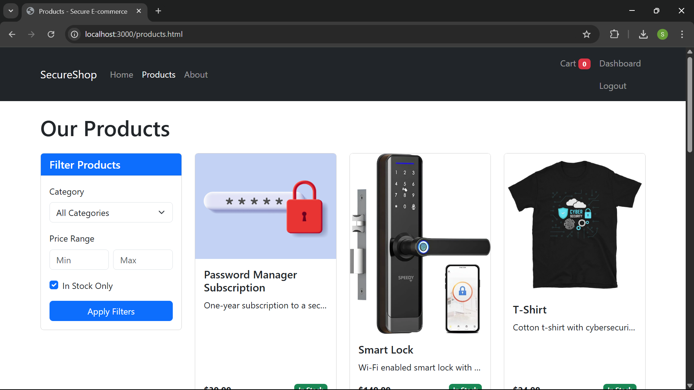
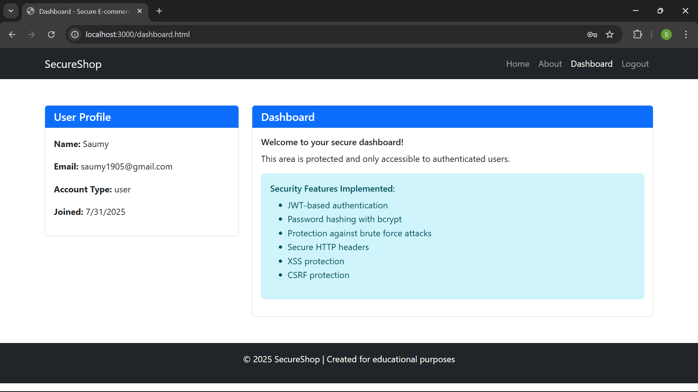
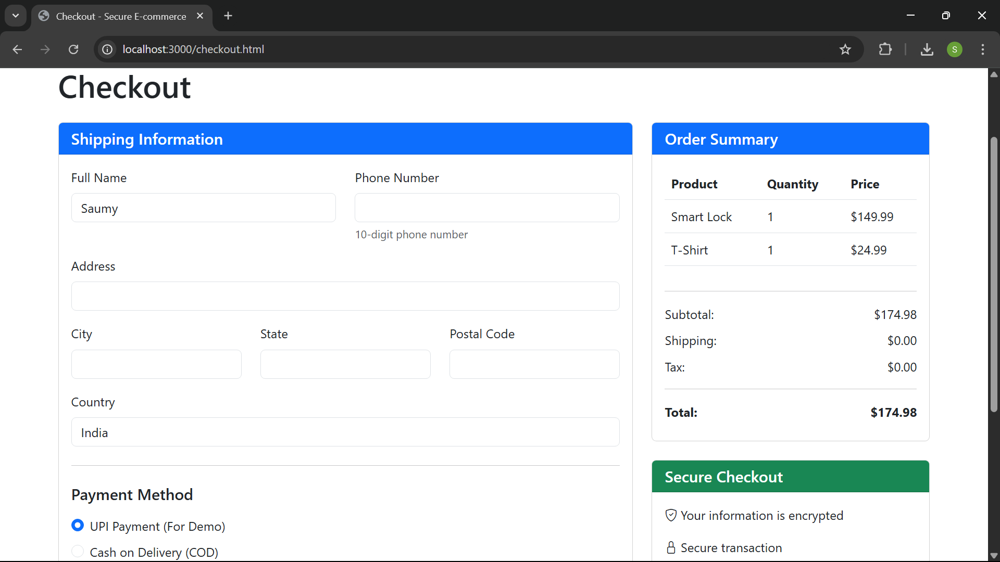

# Secure E-commerce Platform

This repository contains a secure e-commerce platform developed as part of the **Internship Program** at CDAC, Noida. The platform prioritizes user data protection and implements best practices for web security, including robust authentication, session management, and secure payment processing. It is resistant to common web vulnerabilities such as SQL injection, Cross-Site Scripting (XSS), Cross-Site Request Forgery (CSRF), and Denial-of-Service (DoS) attacks.

## Project Overview
The secure e-commerce platform allows users to:
- Register and log in securely
- Browse and search products
- Manage a shopping cart
- Checkout with shipping and payment details
- View and track order history

The project adheres to OWASP Top 10 guidelines and incorporates PCI DSS principles for secure payment handling

## Tech Stack
- **Backend**:
  - **Node.js**: JavaScript runtime for server-side logic
  - **Express**: Web framework for API routing
  - **MongoDB**: NoSQL database for storing users, products, carts, and orders
  - **Mongoose**: ODM for MongoDB schema management
  - **bcrypt**: Password hashing for secure authentication
  - **jsonwebtoken**: JWT-based session management
  - **express-rate-limit**: Rate limiting for API protection
  - **express-validator**: Input validation to prevent injection attacks
- **Frontend**:
  - **HTML/CSS**: Static pages with Bootstrap for responsive design
  - **JavaScript**: Client-side logic for dynamic rendering
  - **Bootstrap**: CSS framework for UI styling
- **Security**:
  - CSRF tokens for form protection
  - HTTPS (assumed for production)
  - Output encoding (`escapeHTML`) to prevent XSS
- **Payment**:
  - **Razorpay**: Mock integration for demo payment processing
- **Development Tools**:
  - **Git**: Version control
  - **npm**: Package management

## Prerequisites
To run the project locally, ensure you have:
- **Node.js** (v16 or higher)
- **MongoDB** (local instance)
- **Git**: For cloning the repository
- **npm**: For installing dependencies
- A web browser (e.g., Chrome, Firefox)

<div align="center">
  
   
  
  <p><em>From left to right: Products Page, Dashboard Cart, Checkout Process</em></p>
</div>

## Setup Instructions
Follow these steps to run the project on your local machine:

1. **Clone the Repository**:
   ```bash
   git clone https://github.com/your-username/secure-ecommerce-platform.git
   cd secure-ecommerce-platform
   ```

2. **Install Dependencies**:
   ```bash
   npm install
   ```

3. **Set Up Environment Variables**:
   Create a `.env` file in the root directory with the following:
   ```env
   PORT=3000
   MONGO_URI=mongodb://localhost:27017/secure-ecommerce
   JWT_SECRET=your_jwt_secret_key
   RAZORPAY_KEY_ID=rzp_test_YourTestKeyId
   RAZORPAY_KEY_SECRET=YourTestKeySecret
   ```
   - Replace `MONGO_URI` with your MongoDB connection string (local).
   - Generate a secure `JWT_SECRET` (e.g., using `crypto.randomBytes(32).toString('hex')`).
   - Use test Razorpay keys for demo purposes.

4. **Set Up MongoDB**:
   - Ensure MongoDB is running locally (`mongod`)
   - The database (`secure-ecommerce`) will be created automatically on first connection.

5. **Seed the Database**:
   Run the seeder script to populate the product catalog:
   ```bash
   node utils/seeder.js
   ```

6. **Start the Server**:
   ```bash
   npm start
   ```
   The application will run at `http://localhost:3000`.

7. **Access the Platform**:
   - Open `http://localhost:3000` in your browser.
   - Register a new user or log in with existing credentials.
   - Browse products, add to cart, checkout, and view orders.

## Usage
- **Home**: Navigate to `index.html` for the landing page.
- **Register/Login**: Use `register.html` and `login.html` for user authentication.
- **Products**: Browse and search products at `products.html`.
- **Cart**: Manage items at `cart.html` (requires login).
- **Checkout**: Complete orders at `checkout.html` with mock payment or COD.
- **Orders**: View order history at `orders.html` and details at `order-detail.html`.
- **Admin**: Admin routes (`/api/admin/*`) are protected and require admin role.

## Security Features
The platform implements robust security measures to mitigate OWASP Top 10 vulnerabilities:
- **A1: Broken Access Control**: JWT authentication (`middleware/auth.js`) and role-based access (`authorize('admin')`).
- **A2: Cryptographic Failures**: Bcrypt password hashing (`controllers/auth.js`), HTTPS assumed.
- **A3: Injection**: Input validation with `express-validator` (`routes/auth.js`, `routes/cart.js`, `routes/orders.js`).
- **A5: Security Misconfiguration**: Secure Express setup with CORS and CSRF middleware (`app.js`).
- **A7: Cross-Site Scripting (XSS)**: Output encoding with `escapeHTML` in client-side scripts (`auth.js`, `cart.js`, `checkout.js`, `orders.js`, `order-detail.js`).
- **A10: Insufficient Logging & Monitoring**: Basic error logging; needs enhancement.
- **CSRF Protection**: Tokens implemented in `checkout.js`, `cart.js`, and `order-detail.js`.
- **Rate Limiting**: `middleware/rateLimit.js` prevents brute-force and DoS attacks.
- **PCI DSS Principles**: Mock Razorpay integration simulates secure payment processing.

## Notes
- **Future Enhancements**:
  - Integrate real payment gateway with full PCI DSS compliance.
  - Add MongoDB indexing for performance.
  - Enhance accessibility with ARIA labels.
  - Implement automated vulnerability scanning.
